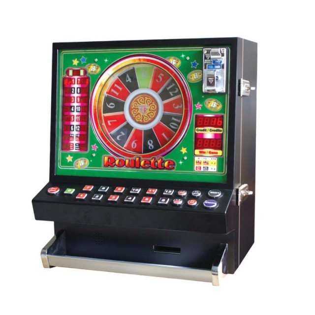
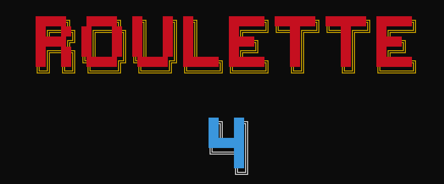

# 🎰 Roulette Simulator - Circle Roulette Little Machine

¡Bienvenido a **Roulette Simulator**! Este proyecto es una herramienta de simulación de ruleta diseñada para ofrecer una experiencia interactiva y estratégica de juego. Desarrollado en Python, permite a los usuarios realizar apuestas, seguir un historial de jugadas y aplicar estrategias basadas en números "calientes" (hotters) y vecinos, con el objetivo de alcanzar un profit deseado. 🤑

---





## 📜 Descripción

**Roulette Simulator** simula una ruleta con un conjunto predefinido de números (0 al 12 por defecto) y permite a los jugadores realizar apuestas basadas en diferentes métodos predictivos. El programa incluye animaciones, cálculo de ganancias y pérdidas, y un sistema de historial para analizar jugadas anteriores. 🎲

### 🛠️ Características Principales
- **Simulación de Ruleta**: Gira la ruleta con una animación personalizada y genera números ganadores aleatorios. 🔄
- **Estrategias de Apuesta**: Usa métodos como `TOP2` (dos números calientes) y `TOP3` (tres números calientes) para apostar en base a estadísticas del historial. 🔥
- **Historial de Jugadas**: Registra los resultados de las rondas anteriores para analizar patrones. 📊
- **Cálculo de Profit**: Calcula automáticamente las ganancias o pérdidas en porcentaje respecto al monto inicial. 💰
- **Vecinos Únicos**: Selecciona vecinos de los números calientes sin repeticiones, optimizando las apuestas. 🧠
- **Antimartingala Opcional**: Aumenta el multiplicador de apuesta tras una victoria para maximizar ganancias. 📈
- **Modo Automático**: Ejecuta múltiples rondas sin intervención manual para probar estrategias. ⚙️
- **Interfaz Visual**: Usa `cfonts` para mostrar números y mensajes en la terminal con colores atractivos. 🌈

---

## 🚀 Instalación

1. **Clona el repositorio** o descarga el archivo `roulette.py`.
2. **Instala las dependencias** ejecutando el siguiente comando en tu terminal:

   ```
   pip install python-cfonts
   pip install python-dotenv
    ```

## 🎮 Uso

```
python roulette.py --method [str] --hot_amount [int] --neight_amount [int] --other_amount [int] --rondas_soportadas [int] --profit_out [int] --use_antigala [int] --autorun [int] --max_repeat [int]
```

## 🆘 Ayuda

```
python roulette.py --help
```

## 📋 Parámetros

- **TOP_METHOD**: Estrategia de selección de números calientes (`TOP2` o `TOP3`). 🔥
- **HOT_AMOUNT**: Monto a apostar por cada número caliente. 💵
- **NEIGHT_AMOUNT**: Monto a apostar por los vecinos de los números calientes. 🧩
- **OTHER_AMOUNT**: Monto a apostar por los números restantes. 💳
- **RONDAS_SOPORTADAS**: Número de rondas que el saldo inicial puede soportar. ⏳
- **PROFIT_OUT**: Porcentaje de profit deseado para retirarse. 🎯
- **USE_ANTIGALA**: Habilita (1) o deshabilita (0) el sistema Antimartingala. 📈
- **AUTORUN**: Habilita (1) o deshabilita (0) el sistema de ejecución automática. 🤖
- **MAX_REPEAT**: Máxima cantidad de jugadas automáticas. 🚀

Ejemplo

    ```
    python roulette.py --method TOP2 --hot_amount 40 --neight_amount 20 --other_amount 10 --rondas_soportadas 20 --profit_out 10 --use_antigala 1 --autorun 1 --max_repeat 100
    ```

## 🕹️ Controles

- **ENTER**: Ejecuta una nueva ronda o confirma acciones.
- **ESC**: Finaliza el juego mostrando el saldo final.

## 🧠 Estrategias de Juego

### 🔥 TOP2
- Selecciona los 2 números más frecuentes del historial. 🔥
- Apuesta un monto mayor en ellos y un monto menor en sus vecinos y otros números. 🧮

### 🔥🔥🔥 TOP3
- Selecciona los 3 números más frecuentes del historial. 🔥🔥🔥
- Similar a TOP2, pero distribuye las apuestas entre tres números calientes y sus vecinos. 📊
- Antimartingala (Opcional)
- Aumenta el multiplicador de las apuestas tras cada acierto, buscando maximizar ganancias en rachas positivas. 📈

## 💻 Detalles Técnicos

- **Lenguaje**: Python 3.x

- **Módulos Utilizados**:
  - `msvcrt`: Captura de teclas en Windows. ⌨️
  - `cfonts`: Renderizado de texto en la terminal con colores. 🌈
  - `random`: Generación de números aleatorios. 🎲
  - `dotenv`: Cargar variables desde archivo de configuración. 💾
  - `itertools` y `collections`: Manejo de datos para historial y frecuencias. 📊

- **Clase Principal**: `CircleRouletteLittleMachine` - Gestiona la ruleta, apuestas, historial y cálculos. ⚙️

## 📊 Resultados y Estadísticas

El simulador muestra en cada ronda:

- Números calientes seleccionados. 🔥
- Apuestas realizadas. 🎟️
- Número ganador. 🎯
- Ganancias o pérdidas. 💵❌
- Porcentaje de profit actual. 🤑

Al finalizar, se presenta un resumen del historial de jugadas. 📜


## 🛑 Finalización del Juego

El juego termina en los siguientes casos:

- Se alcanza el porcentaje de profit deseado (PROFIT_OUT). 🎉
- El saldo se agota. 😢
- El usuario presiona ESC para salir manualmente. 🚪
- Se alcanza el límite de rondas automáticas (si está habilitado el modo automático). ⏱️

## 👨‍💻 Autor

- **José E. Morales Ventura**
- **Fecha de creación**: 15 de Junio de 2025

## 🤝 Contribuciones

¡Siéntete libre de contribuir al proyecto! Puedes abrir issues o enviar pull requests con mejoras, correcciones o nuevas funcionalidades. 🌟

## 📝 Licencia

Este proyecto es de código abierto y está disponible bajo la licencia MIT. 🔓

🎰 ¡Buena suerte y que gire la ruleta! 🎰